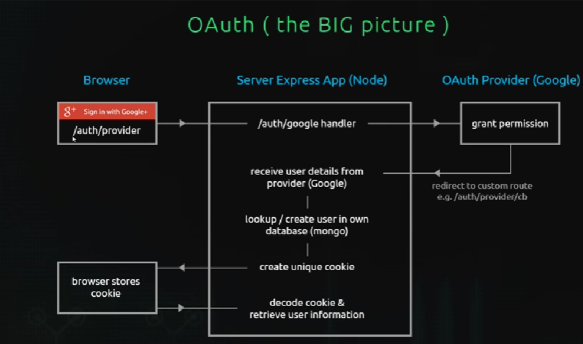

# HOW GOOGLE OAUTH WORKS



* create a simple express application
    * app.js
```
const express=require("express")

const app=express()


app.use(express.static('public'))

app.use('/css',express.static(__dirname+'public/css'))

//set up view engine

app.set("view engine",'ejs')

//create home route
app.get("/",(req,res)=>{
 res.render("home")
})

app.listen(5000,()=>{
    console.log("app now listening on port 3000")
})
```

# creates routes fpr different pages

/auth/google

```
const router=require('express').Router()

//auth login
router.get("/login",(req,res)=>{
  res.render('login')
})

//auth logout
router.get("/logout",(req,res)=>{
    res.send("logging out")
})

//auth with google

router.get("/google",(req,res)=>{
   //handle with passport
   res.send("login with google")
})

module.exports=router
```

# enable google API

* go to link 

```
https://console.cloud.google.com/
```

* create project
* co to search and find google +.api
* click on enable
* click on create credentials
* select webapplication
* give name
* then client ID AND SECREAT KEY IS GENRATED
*  create passport.js file in config
* and create keys.js in which save keys
* add them in passport.js

```
const passport=require('passport')
const googleStrategy=require("passport-google-oauth").OAuth2Strategy
const keys=require('./keys')
passport.use(
    new googleStrategy({
    //option for the google strategy
    callbackURL:"/auth/google/redirect",
    clientID:keys.google.clientID,
    clientSecret:keys.google.clientSecret 
},()=>{
    //passport callback function 
})
)

```

need to install 

```
npm install cookie-session
```
https://user-images.githubusercontent.com/77602685/167344535-2c301e2d-67cb-43bf-9c72-387cae7b3e11.mp4
